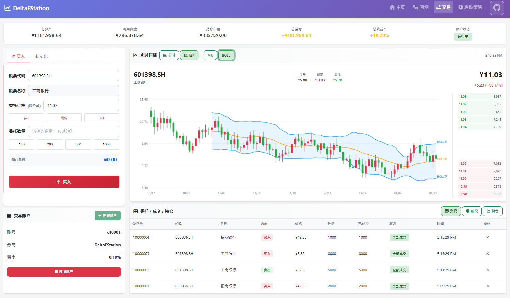
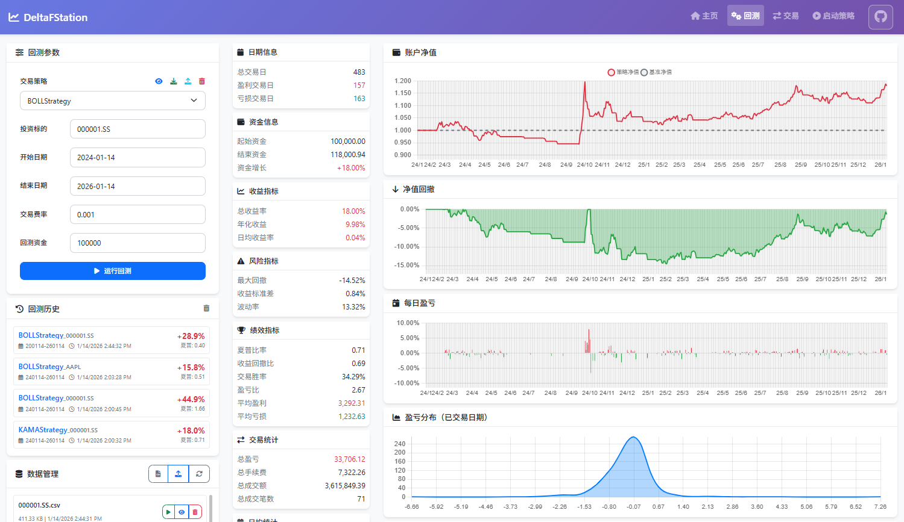
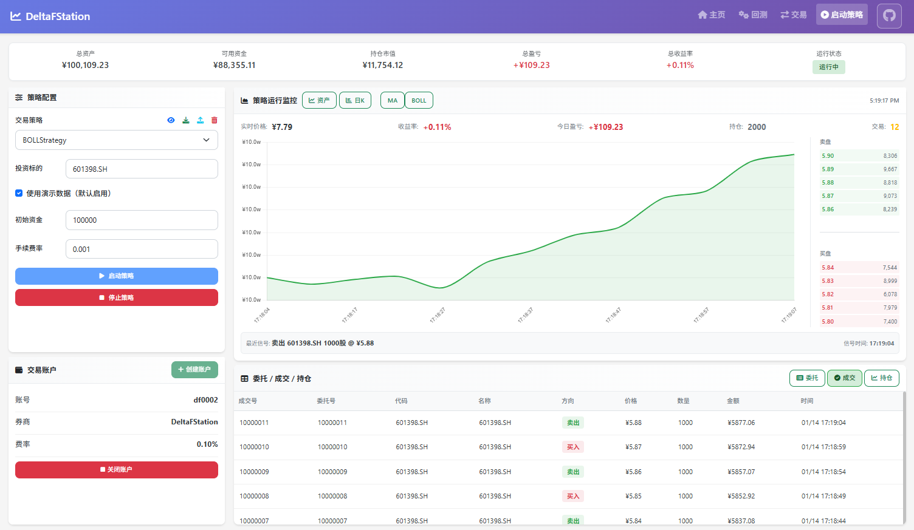

<div align="center">

# DeltaFStation

[中文](README.md) | [English](README_EN.md)


基于 deltafq 的开源量化交易云平台，集成数据服务、策略管理与交易接入，支持模拟与实盘。





</div>

## 安装

```bash
pip install -r requirements.txt
```

## 快速开始

```bash
python run.py
```

打开浏览器访问: http://localhost:5000

## 核心功能

```
DeltaFStation/
├── 策略回测      # 策略创建、历史数据回测、绩效分析
├── 手动交易      # 账户管理、手动买卖、持仓跟踪
├── 策略运行      # 自动交易、实时监控、信号执行
└── AI 小助手     # 智能问答、使用指导、上下文感知帮助
```

## 项目结构

```
deltafstation/
├── backend/          # 后端代码
│   ├── api/          # API 接口
│   └── core/         # 核心模块
├── frontend/         # 前端代码
│   ├── templates/    # HTML 模板
│   │   └── _ai_assistant.html  # AI 小助手组件
│   └── static/       # 静态资源
│       ├── css/      # 样式文件
│       │   └── ai-assistant.css  # AI 小助手样式
│       └── js/       # JavaScript 文件
│           └── ai-assistant.js   # AI 小助手逻辑
├── data/             # 数据目录
│   ├── raw/          # 原始数据
│   ├── results/      # 回测结果
│   └── strategies/   # 策略文件
└── run.py           # 启动脚本
```

## 技术架构


## 社区与贡献

- 欢迎通过 [Issue](https://github.com/delta-f/deltafstation/issues) 或 [PR](https://github.com/delta-f/deltafstation/pulls) 反馈问题、提交改进。

## 许可证

MIT License，详见 [LICENSE](LICENSE)。
