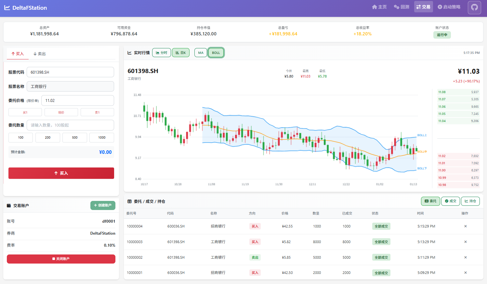
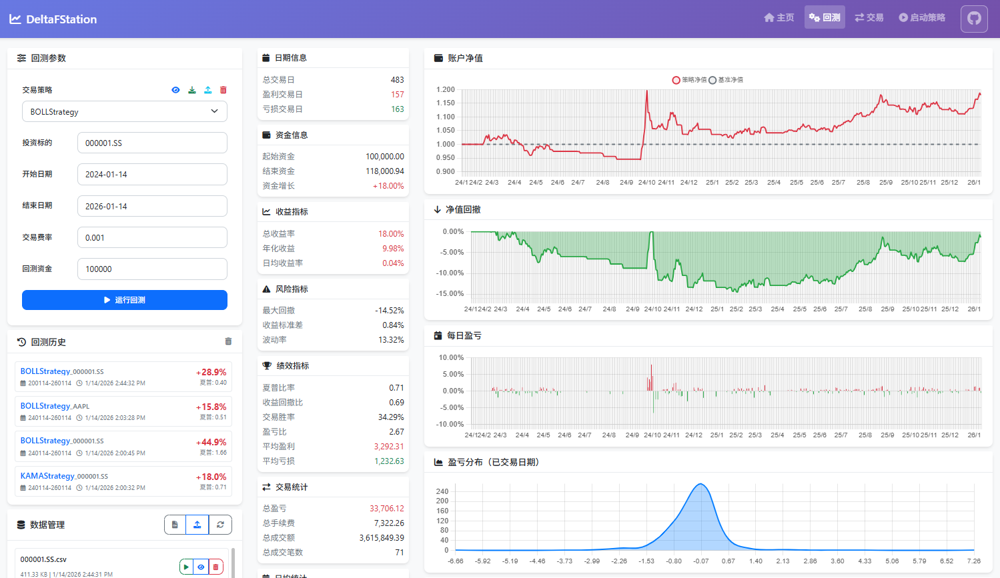
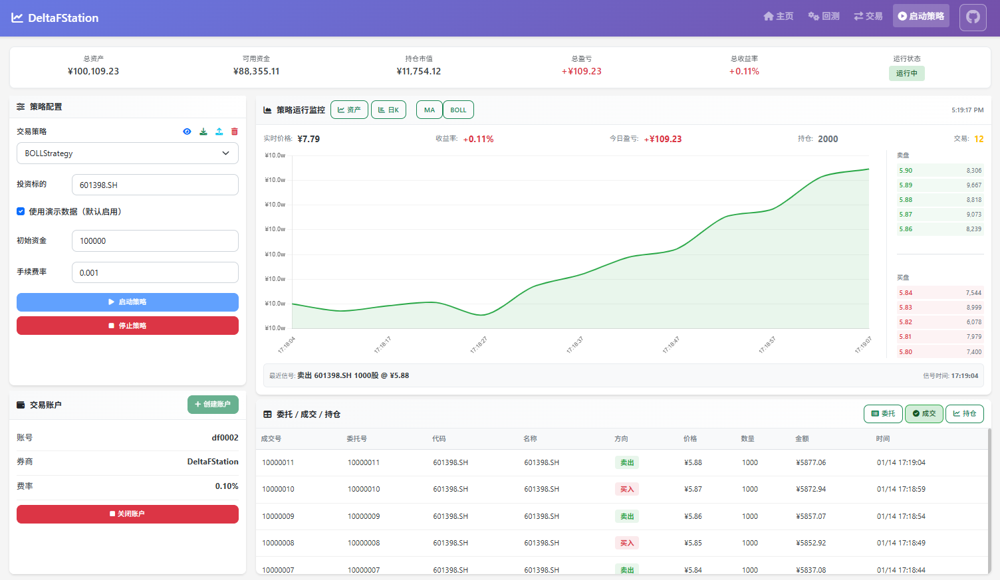

<div align="center">

# DeltaFStation

[中文](README.md) | [English](README_EN.md)


DeltaFStation 是基于 deltafq 的开源量化交易工作站，提供行情数据管理、策略开发与回测、手动模拟交易、策略自动运行及 AI Agent 辅助分析的一体化 Web 体验。





</div>

## 🎓 官方教程

#### [慕课网 - 程序员 AI 量化理财体系课](https://class.imooc.com/sale/aiqwm)

> 项目官方配套课程：深度解析本框架从 0 到 1 的架构设计，涵盖实盘闭环逻辑与工业级量化开发实战，是掌握本项目精髓的进阶必修课。

## 🚀 安装与启动

```bash
pip install -r requirements.txt
python run.py
```

## ✨ 核心功能

- 📊 数据服务 - 行情数据管理与更新，统一回测、模拟与策略运行的数据入口
- 📉 回测中心 - 策略创建、历史数据回测、绩效分析、结果落盘与可视化报告
- 🧾 手动交易 - 管理账户（选择/新建）、本地模拟按 tick 撮合、买卖执行与持仓盈亏跟踪
- ⚡ 策略运行 - 自动交易流程编排、实时监控、信号执行与运行日志追踪
- 🤖 AI Agent - 支持 LLM 配置、对话、工具（Tool）与技能（Skills）调用

### 🔌 接口集成

- [Data] yfinance ✅ - 美股、A股、港股、加密、股指
- [Data] eastmoney ✅ - 场外基金（指数、QDII、股、债、混合）
- [Data] miniQMT ⏳ - A 股行情接入（详情见课程实盘章节）
- [Trade] PaperTrade ✅ - 本地模拟交易、挂单按 Tick 撮合、持仓与订单管理
- [Trade] miniQMT Trade ⏳ - A 股实盘交易（详情见课程实盘章节）

## 🗂️ 项目结构

```
deltafstation/
├── assets/           # 文档与展示图片
├── backend/
│   ├── api/          # REST API
│   │   ├── data_api.py
│   │   ├── strategy_api.py
│   │   ├── backtest_api.py
│   │   ├── ai_api.py          # AI Agent：LLM 对话（SSE 流式）；可选注入回测 SKILL
│   │   ├── simulation_api.py   # 手动交易：账户、下单
│   │   └── gostrategy_api.py   # 策略运行：启动/停止、K 线
│   ├── core/         # 核心引擎
│   │   ├── data_manager.py
│   │   ├── live_data_manager.py
│   │   ├── backtest_engine.py
│   │   ├── simulation_engine.py      # 手动交易 tick 撮合
│   │   ├── strategy_engine.py     # 策略自动化 LiveEngine
│   │   ├── agent/                   # AI Agent 编排层（OpenAI 兼容：DeepSeek / OpenAI / 通义等）
│   │   │   ├── llm_client.py
│   │   │   ├── skill_prompt.py      # 关键词命中时加载 skills/*/SKILL.md 注入 system prompt
│   │   │   ├── skills/              # Markdown Skill（如 backtest/SKILL.md）
│   │   │   ├── tool_registry.py     # 工具 schema / handler 注册（TOOL_DEFINITIONS）
│   │   │   ├── tool_runner.py       # 多轮 tool_calls 编排执行
│   │   │   └── tools/              # 工具实现（handler）
│   │   │       ├── fun_tools.py
│   │   │       ├── backtest_tools.py
│   │   │       └── backtest_auto_tools.py
│   │   ├── utils/
│   │   │   ├── engine_snapshot.py
│   │   │   ├── sim_persistence.py
│   │   │   └── strategy_loader.py
│   └── app.py        # Flask 入口
├── config/
├── data/
│   ├── raw/          # 原始行情 CSV
│   ├── results/      # 回测结果 JSON
│   ├── simulations/  # 仿真账户配置 JSON
│   └── strategies/   # 策略 Python 文件
├── frontend/
│   ├── templates/    # index / backtest / trader / gostrategy
│   └── static/           # 静态资源（css/js）
├── requirements.txt
└── run.py
```

## 🏗️ 技术架构

DeltaFStation 基于 Flask 构建 Web 端，后端集成 deltafq 量化框架，实现从策略研发到交易接入的云端工作流：
https://github.com/Delta-F/deltafq

<table>
  <tr>
    <td></td>
    <td></td>
  </tr>
</table>

## 🤝 社区与贡献

- 欢迎通过 [Issue](https://github.com/delta-f/deltafstation/issues) 或 [PR](https://github.com/delta-f/deltafstation/pulls) 反馈问题、提交改进。
- 微信公众号：关注 `DeltaFQ开源量化`，获取版本更新与量化资料。

<p align="center">
  
</p>

## ⚖️ 许可证

MIT License，详见 [LICENSE](LICENSE)。
