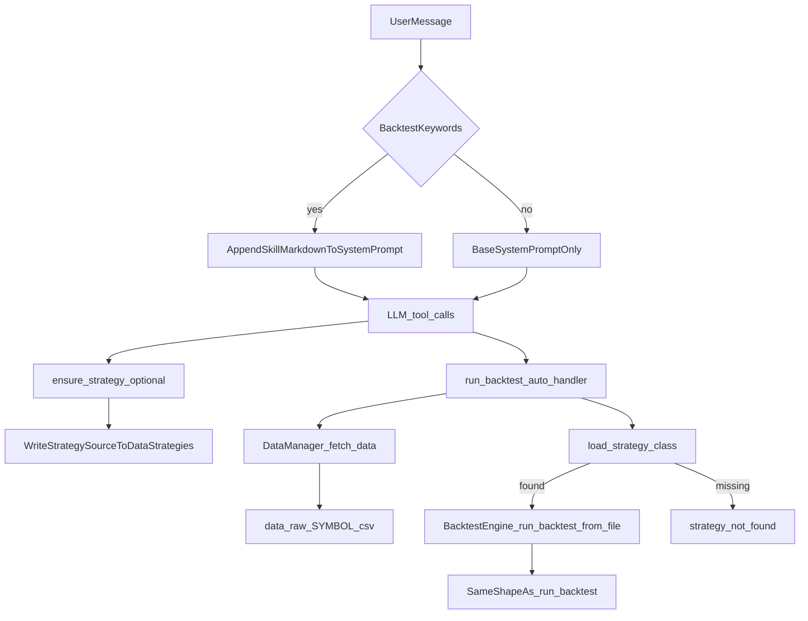

# Agent 回测 Skill + 自动拉数与策略落盘

## 目标行为

- **触发词**：当用户消息命中一组中英文关键词（如：`回测`、`backtest`、`跑策略`、`测试策略`、`strategy test` 等，维护于 [backend/core/agent/skill_prompt.py](backend/core/agent/skill_prompt.py)）时，将回测 skill 的正文追加进 **system prompt**。
- **System 日期锚定**：[backend/api/ai_api.py](backend/api/ai_api.py) 在每条对话的 system 中注入服务器本地日 `Server date (local): YYYY-MM-DD`，并说明相对区间（如「近 N 年/月」）须以此日为 `end_date`、换算出 `start_date`，向工具传 `YYYY-MM-DD`，勿凭模型训练知识猜当前年份。
- **Skill 正文约定**：[SKILL.md](backend/core/agent/skills/backtest/SKILL.md) 写明行情走 **yfinance**、`symbol` 为 yfinance ticker；相对区间与上述 **Server date** 对齐。
- **Skill 加载**：`skill_prompt` 用 `pathlib` 定位 `skills/backtest/SKILL.md`，`load_backtest_skill_markdown` 带 `@lru_cache` 进程内只读盘一次。
- **默认策略**：用户未指定策略时，使用 **`BOLLStrategy`**（与 [data/strategies/boll_strategy.py](data/strategies/boll_strategy.py) 对齐）。
- **新策略**：由模型调用 **`ensure_strategy`**，传入 `class_name` 与完整 `source_code`，写入 [data/strategies/](data/strategies/) 并经 `compile` + `load_strategy_class` 校验；**不再**由服务端自动生成占位策略。随后用 **`run_backtest_auto`** 传入对应 `strategy_id`。若类未找到，`run_backtest_auto` 返回 `strategy_not_found`。

## 架构与数据流

## 涉及文件

| 说明 | 路径 |
|------|------|
| Skill 文档 | [backend/core/agent/skills/backtest/SKILL.md](backend/core/agent/skills/backtest/SKILL.md) |
| 关键词与加载 | [backend/core/agent/skill_prompt.py](backend/core/agent/skill_prompt.py) |
| Prompt 注入 | [backend/api/ai_api.py](backend/api/ai_api.py) |
| 自动回测工具 | [backend/core/agent/tools/backtest_auto_tools.py](backend/core/agent/tools/backtest_auto_tools.py) |
| 结果落盘与摘要复用 | [backend/core/agent/tools/backtest_tools.py](backend/core/agent/tools/backtest_tools.py)（`build_backtest_brief_and_persist`） |
| 工具注册 | [backend/core/agent/tool_registry.py](backend/core/agent/tool_registry.py)（`ensure_strategy`、`run_backtest_auto`） |

## 工具 `ensure_strategy` 要点

- **入参**：`class_name`、`source_code` 必填；可选 `file_basename`、`overwrite`。
- **流程**：`compile` → 写入 `data/strategies/` → `load_strategy_class(class_name)`；失败则回滚文件。

## 工具 `run_backtest_auto` 要点

- **入参**：`symbol` 必填；`strategy_id` 可选（缺省 `BOLLStrategy`）；可选 `start_date`、`end_date`、`initial_capital`、`commission`、`slippage`、`trade_preview_count`。
- **流程**：`DataManager.fetch_data` → `load_strategy_class`；若类不存在则返回 **`strategy_not_found`**（不自动写文件）→ 否则 `BacktestEngine.run_backtest_from_file`。
- **返回**：与 `run_backtest` 成功结构一致；`summary_metrics` 含 `total_trades`、`avg_trades_per_day`；`extra` 含拉数状态等（不再包含「自动生成策略」字段）。

## 验证方式

- 本地调用 `handle_run_backtest_auto({'symbol':'000001.SS'})`，不传 `strategy_id`，在存在 `BOLLStrategy` 时应成功。
- 指定不存在类名，应返回 `strategy_not_found`，且不应新建占位 `agent_generated_*.py`。
- 先 `handle_ensure_strategy` 写入合法类，再 `run_backtest_auto` 带该 `strategy_id`，应成功。
- 用户消息含「回测」等关键词时，system prompt 应包含 `Project backtest skill:` 与 SKILL 正文。

## 风险与约束

- **写入 `data/strategies/`**：类名与文件名需安全化，避免覆盖与路径遍历。
- **Windows 控制台编码**：底层 `deltafq` 日志可能含 Unicode，与 JSON 返回无关时可忽略。
