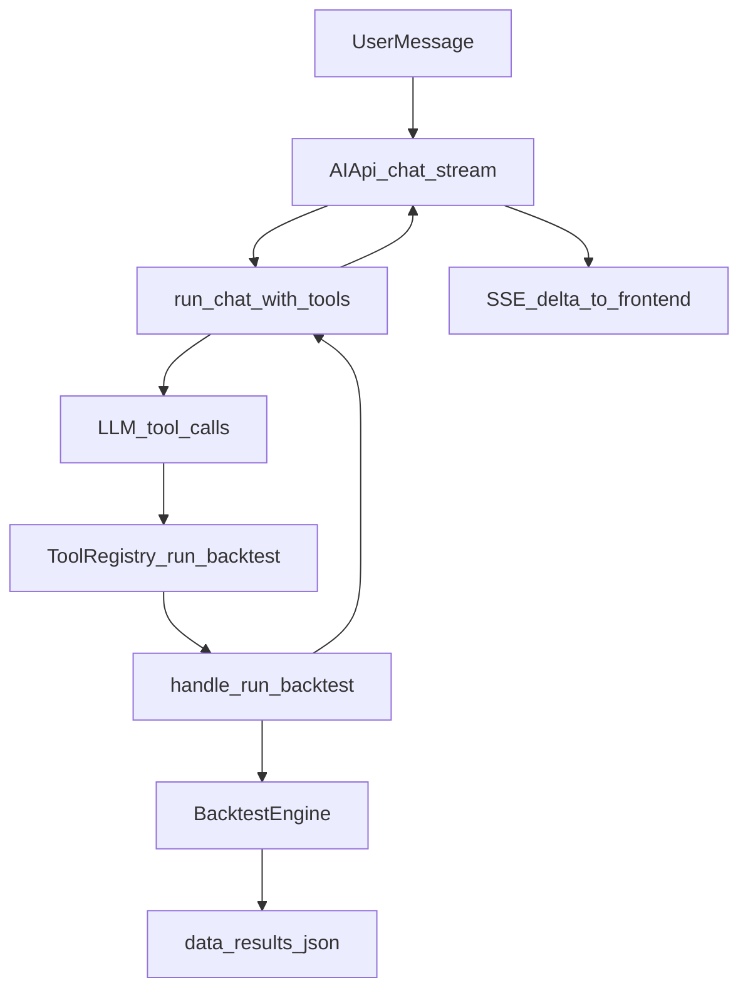

# 基于当前框架接入回测工具调用计划

## 目标

让 AI 在 `tools` 模式下可以直接触发一次回测执行（等价于调用后端回测能力），并返回统一模板：`resolved.date_range + summary_metrics + trade_preview`，支持后续自然语言总结与“最近交易记录”追问。

## 现状与接入点

- 现有工具注册与分发在 [backend/core/agent/tool_registry.py](backend/core/agent/tool_registry.py) 与 [backend/core/agent/tool_runner.py](backend/core/agent/tool_runner.py)。
- AI 入口已在 [backend/api/ai_api.py](backend/api/ai_api.py) 调用 `run_chat_with_tools(...)`，无需改动调用链。
- 回测能力已在 [backend/core/backtest_engine.py](backend/core/backtest_engine.py) 与 [backend/api/backtest_api.py](backend/api/backtest_api.py) 可复用。

## 实施步骤

1. 新增 Agent 回测工具实现文件
  - 新建 `backend/core/agent/tools/backtest_tools.py`。
  - 提供 `handle_run_backtest(args)`：
    - 入参校验：`strategy_id`、`data_file` 必填；可选 `start_date`、`end_date`、`symbol`、`initial_capital`、`commission`、`slippage`、`trade_preview_count`。
    - 增加**必填参数模糊匹配**：
      - `strategy_id`：支持关键词匹配、忽略大小写（例如“ma crossover”可匹配到具体策略 ID）。
      - `data_file`：优先基于投资标的代码匹配（从文件名中提取 symbol 进行匹配），忽略大小写。
      - 匹配规则优先级：精确命中 > 规范化命中（大小写/空白）> 模糊包含。
    - 歧义处理：当任一必填参数出现多候选时，**不执行回测**，返回结构化候选列表（供模型追问用户确认）。
    - 直接复用 `BacktestEngine` 运行回测（不走 HTTP 回环调用）。
    - 生成与现有接口一致或兼容的 `result_id` 并写入 `data/results/`（保持现有结果文件习惯）。
    - 返回结构化 JSON：`status`、`result_id`、`resolved`、`summary_metrics`、`trade_preview`。
2. 在工具注册中心暴露新工具
  - 修改 [backend/core/agent/tool_registry.py](backend/core/agent/tool_registry.py)：
    - 新增 function schema（例如 `run_backtest`）。
    - 在 `AGENT_TOOLS` 增加参数定义与中文描述。
    - 在 `TOOLS_MAP` 绑定到 `handle_run_backtest`。
    - 更新 `__all__` 导出。
3. 确保工具输出稳定且对 LLM 友好
  - 统一 handler 返回值为 JSON 字符串，异常时返回 `{"error": "..."}`，与现有 `_run_tool(...)` 约定一致。
  - 对 `metrics` 的数值做可序列化保护（NaN/Inf 置空），避免模型拿到非法 JSON。
  - `resolved.date_range` 统一返回起始与结束日期，优先使用入参；若未传则从回测结果时间序列推断。
  - `trade_preview` 默认返回最近 10 笔交易，支持 `trade_preview_count` 控制返回条数（上限 50）。
  - 增加模糊匹配结果协议：
    - 唯一命中：正常执行并返回摘要。
    - 零命中：返回 `{"error":"no_match", "field":"strategy_id|data_file", "candidates":[]}`。
    - 多命中：返回 `{"error":"ambiguous_match", "field":"strategy_id|data_file", "candidates":[...]}`。
4. 轻量验证
  - 通过最小化脚本或 REPL 调用 `handle_run_backtest(...)` 验证成功路径与错误路径（缺参数、零命中、多命中、文件不存在、策略不存在）。
  - 验证 AI tools 模式能触发新函数并收到摘要结果文本。

## 数据流（工具调用）



## 返回模板（当前实现）

```json
{
  "status": "success",
  "message": "Backtest completed successfully",
  "result_id": "res_xxx",
  "resolved": {
    "strategy_id": "BOLLStrategy",
    "symbol": "000001.SS",
    "data_file": "000001.SS.csv",
    "date_range": {
      "start_date": "2024-03-25",
      "end_date": "2026-03-25"
    }
  },
  "summary_metrics": {
    "total_return_pct": 25.05,
    "annualized_return_pct": 13.18,
    "max_drawdown_pct": -13.08,
    "sharpe_ratio": 1.03,
    "win_rate_pct": 80.0,
    "profit_loss_ratio": 1.04
  },
  "trade_preview": {
    "count": 10,
    "items": [
      {
        "date": "2026-03-03 00:00:00",
        "side": "SELL",
        "price": 4122.67,
        "qty": 31,
        "pnl": 1449.16
      }
    ]
  }
}
```

## 指标映射（与回测 UI 对齐）

- `summary_metrics.total_return_pct` <- `metrics.total_return * 100`
- `summary_metrics.annualized_return_pct` <- `metrics.annualized_return * 100`
- `summary_metrics.max_drawdown_pct` <- `metrics.max_drawdown * 100`
- `summary_metrics.sharpe_ratio` <- `metrics.sharpe_ratio`
- `summary_metrics.win_rate_pct` <- `metrics.win_rate * 100`
- `summary_metrics.profit_loss_ratio` <- `metrics.profit_loss_ratio`


## 交付结果

- AI 能在 `tools` 模式下执行回测。
- 工具回传标准模板（含 `resolved.date_range` 与 `trade_preview`），支持后续追问交易记录。
- `strategy_id` 与 `data_file` 支持模糊匹配；当存在歧义时返回候选而不是误执行。
- 不改变现有 `ai_api.py` 工具调用主循环，仅做工具扩展，风险最小。
