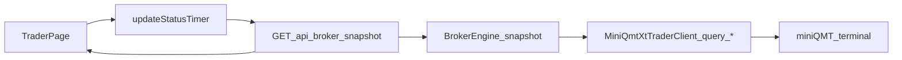

# 同步券商账户数据方案

> **实现状态（1.3.0）**  
> - **交易页**手动 broker：本文档描述的 snapshot 轮询链路 ✅，见 `BrokerEngine` + `broker_snapshot` + `trader.js`。  
> - **策略运行页** QMT 自动交易：见 [qmt-strategy-live.md](qmt-strategy-live.md)（`StrategyEngine` 占用会话、与交易页互斥、`GET /api/broker/snapshot` 可代理策略会话）。

## 目标

让交易页中的账户信息与 miniQMT 柜台保持一致，覆盖以下四类数据：

- 资金（cash / frozen_cash / total_asset）
- 持仓（symbol / volume / can_use_volume / market_value）
- 委托（order_status、成交量、价格、方向）
- 成交（traded_price、traded_volume、成交时间）

## 现有能力（可直接复用）

- 你参考的客户端文件 [c:\Users\leek_\Desktop\Delta\imooc\deltafq\deltafq\adapters\trade\miniqmt_client.py](c:\Users\leek_\Desktop\Delta\imooc\deltafq\deltafq\adapters\trade\miniqmt_client.py) 已提供查询方法：
  - `query_stock_asset()`
  - `query_stock_positions()`
  - `query_stock_orders(cancelable_only=False)`
  - `query_stock_trades()`
- [backend/core/broker_engine.py](backend/core/broker_engine.py)：miniQMT **会话**（connect / 下单 / 撤单）。
- [backend/core/utils/broker_snapshot.py](backend/core/utils/broker_snapshot.py)：`query_*` → 标准化快照 JSON；`build_state_from_broker_snapshot` 供策略页 state。
- `BrokerEngine.snapshot()` 调用 `collect_broker_snapshot`，不再在引擎类内重复组装字段。
- API 文件 [c:\Users\leek_\Desktop\Delta\imooc\deltafstation\backend\api\broker_api.py](c:\Users\leek_\Desktop\Delta\imooc\deltafstation\backend\api\broker_api.py) 提供 `/api/broker/snapshot`。
- 前端文件 [c:\Users\leek_\Desktop\Delta\imooc\deltafstation\frontend\static\js\trader.js](c:\Users\leek_\Desktop\Delta\imooc\deltafstation\frontend\static\js\trader.js) 已有 `updateStatus()` 定时刷新入口。

## 推荐同步机制

- 前端每 3-5 秒轮询一次 `/api/broker/snapshot`。
- 后端每次请求都从柜台实时查询并返回标准化 JSON。
- 前端使用“覆盖策略”更新 `state.simulation`：
  - `asset/positions/orders/trades` 全量覆盖；
  - 本地仅保留 UI 临时字段，不作为真实交易状态来源。

## 状态映射建议（订单）

把柜台 `order_status` 映射为前端通用状态，便于统一渲染：

- `pending`: 48, 49, 50, 51, 55
- `executed`: 56
- `cancelled`: 52, 53, 54, 57
- 其余保留 `raw_status` 兜底显示

同时返回：

- `filled_quantity`（来自 `traded_volume`）
- `raw_status`（原始数值）

这样前端可以同时展示“中文三态 + 柜台原始状态码”。

## 前端更新策略（关键）

在 `updateStatus()` 的 broker 分支里：

- 用 `asset` 更新总资产、可用资金、冻结资金。
- 用 `positions` 更新持仓表与可卖数量。
- 用 `orders` 覆盖委托表（不要只依赖本地下单后 push 的 pending）。
- 用 `trades` 覆盖成交表（保证已成单及时可见）。

错误处理建议：

- `snapshot` 返回 `broker is not connected` 时，将账户标记为 `stopped` 并停止继续轮询该账户。
- 连接失败时直接展示 connect 错误，不再持续刷 snapshot 错误。

## 验证清单

- 下单后 1-2 个轮询周期内，委托状态从 `pending` 变为 `executed/cancelled/partially...`（按映射显示）。
- 成交表能看到对应 `order_id`、成交价、成交量、时间。
- 资金与持仓在成交后发生正确变化。
- 断开连接后 UI 状态自动降为 `stopped`，无无效轮询刷屏。

## 你现在可直接执行的联调步骤

- 先 `POST /api/broker/connect`
- 持续 `GET /api/broker/snapshot`，观察 `asset/positions/orders/trades` 字段变化
- 页面点击下单后，对比：
  - 柜台客户端真实状态
  - snapshot 返回状态
  - 页面渲染状态

三者一致即同步链路完成。

## 与策略运行页的扩展（1.3.0）

| 场景 | 行为 |
|------|------|
| `StrategyEngine` 以 broker 账户运行中 | `POST /api/broker/connect`、手动 `POST /api/broker/orders` 返回 **409** |
| 策略占用会话时查快照 | `GET /api/broker/snapshot` 由 `StrategyEngine.get_broker_snapshot_payload()` **代理**同一柜台数据 |
| 启动 broker 策略前 | `gostrategy_api` 会 `BrokerEngine.disconnect()`，避免双会话抢 QMT |

策略页展示用 `GET /api/simulations/<id>` 合并 `StrategyEngine` 柜台 state，逻辑与交易页 snapshot 字段对齐，详见 [qmt-strategy-live.md](qmt-strategy-live.md)。
