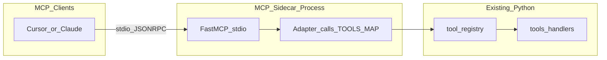

# DeltaFStation MCP 侧车适配计划

## 现状摘要

- 工具单一来源：[backend/core/agent/tool_registry.py](backend/core/agent/tool_registry.py) 的 `TOOL_DEFINITIONS`（name / description / parameters JSON Schema）与 `TOOLS_MAP`（`Dict[str, Any] -> str`）。
- 执行约定与 [backend/core/agent/tool_runner.py](backend/core/agent/tool_runner.py) 一致：handler 接收 **JSON 对象**，返回 **字符串**（多为 JSON 文本）。
- 回测等工具内部以相对仓库根目录的 `data/` 读写（见 [backend/core/agent/tools/backtest_tools.py](backend/core/agent/tools/backtest_tools.py) 中的 `_BASE_DIR`），因此 MCP 进程的工作目录与 `PYTHONPATH` 必须指向**仓库根**（即 `deltafstation`），与 Flask 是否运行无关。

## 架构（Sidecar + stdio）



- **不**把 MCP 绑进 Flask 进程：独立脚本通过 stdio 与宿主通信，直接 import `backend.*`，与提示中的 Sidecar 一致。
- 若将来要通过 REST 调已运行的 Flask，可另增 HTTP `Session` 工具；首版以直接调用 core 为主，延迟最低、与现有 Agent 路径一致。

## 实现要点

### 1. 依赖

- 在 [requirements.txt](requirements.txt) 增加：`mcp`（版本可按实现时锁定，例如 `mcp>=1.0.0`，以你本机 `pip install mcp` 解析结果为准）。

### 2. 入口脚本位置与启动

- 建议新增单文件入口，例如 [mcp_server.py](mcp_server.py)（仓库根）或 [scripts/deltafstation_mcp.py](scripts/deltafstation_mcp.py)，末尾 `mcp.run(transport="stdio")`（FastMCP 默认即 stdio）。
- **工作目录**：客户端配置里用 `cwd` 指向仓库根（若客户端支持）；否则在脚本开头 `os.chdir` 到仓库根（根据 `__file__` 解析），避免相对路径错位。
- **`PYTHONPATH`**：必须包含仓库根，否则 `from backend.core...` 失败。优先在客户端 `env` 里设置 `PYTHONPATH=<repo_root>`，与脚本内 `chdir` 二选一或双保险。

### 3. 工具注册策略（与 MCP Schema 的取舍）

FastMCP 通常从 **Python 函数签名** 推断 `inputSchema`，难以无损复用 `TOOL_DEFINITIONS` 里完整的 JSON Schema（字段说明、required 等）。可选两种落地方式：

| 方案 | 做法 | 优点 | 代价 |
|------|------|------|------|
| **A（推荐首版）** | 为 `TOOLS_MAP` 的 4 个 name 各写一个 `async def`，参数表与 `tool_registry` 对齐，docstring 复制/简述 description；函数体内 `json.dumps` 或直接传 dict 调 `TOOLS_MAP[name](args)`。 | MCP 侧参数体验好、与现有逻辑 100% 一致。 | 新增工具时需同步加一个 `@mcp.tool()`（或维护一个小表生成 wrapper）。 |
| **B** | 仅暴露 `invoke_tool(name: str, arguments: dict)` 一个 MCP tool，在 description 中嵌入各工具 JSON Schema 摘要或指向仓库文档。 | 零重复签名。 | 模型易填错 `name`/字段，体验较差。 |

首版建议 **方案 A**，与「低开发成本、Tool-ready」目标一致；工具数量目前仅 4 个，维护量可控。

### 4. Resources / Prompts（可选第二阶段）

- **Resources**：用 `FastMCP` 的 `@mcp.resource("result://...")` 或等价 API，读取 [data/results](data/results) 下最新报告、`data/raw` 索引等（注意大文件与敏感路径，可做只读 + 大小上限）。
- **Prompts**：用 `@mcp.prompt()` 封装固定工作流文案（如「先 `run_backtest_auto` 再解读 summary_metrics」），与提示表一致。

首版可只做 **Tools**，Resources/Prompts 在计划中列为后续迭代。

### 5. 安全与环境

- MCP 客户端会继承启动命令的环境变量；**不要**在 MCP 配置 JSON 中写入 API Key。若日后 MCP 工具需要调 LLM，应读 `os.environ`（与 Flask 的 `LLM_API_KEY` 等对齐），并在文档中说明在系统/用户环境或 `.env` 加载方式。
- `ensure_strategy` / 回测会写 `data/strategies` 与 `data/results`，需在说明中注明：**具备写盘权限**，仅在内网/可信环境启用。

## 客户端「适配配置」模板

以下占位符请替换为你的本机路径：

- `REPO` = `c:\Users\leek_\Desktop\Delta\imooc\deltafstation`
- `PY` = 该仓库虚拟环境中的解释器，例如 `REPO\.venv\Scripts\python.exe`（若无 venv，则用你安装依赖的 `python.exe`）

### Claude Desktop（`claude_desktop_config.json`）

在 `mcpServers` 中增加一项（字段名以 Claude Desktop 当前版本为准，常见为 `command` / `args` / `env` / `cwd`）：

```json
{
  "mcpServers": {
    "deltafstation": {
      "command": "PY",
      "args": ["REPO\\mcp_server.py"],
      "cwd": "REPO",
      "env": {
        "PYTHONPATH": "REPO"
      }
    }
  }
}
```

### Cursor（User MCP 或可选本地项目文件）

与 Claude 类似：使用 **stdio** 类型，`command` + `args`，并设置 `env.PYTHONPATH` 与可选 `cwd`。**完整片段与说明（含是否使用 `.cursor/mcp.json`）见 [docs/mcp-client-config.md](mcp-client-config.md)**，仓库不提交 `.cursor/mcp.json`，避免路径误解。

### 验证步骤（实现后）

1. 在仓库根激活 venv，`pip install -r requirements.txt`。
2. 终端执行：`PY mcp_server.py`（应阻塞等待 stdio，无立即报错）。
3. 在 Cursor/Claude 中启用该 MCP，发一条会触发 `get_fun_station_tip` 或 `run_backtest_auto` 的对话做冒烟测试。

## 关键文件一览

| 用途 | 路径 |
|------|------|
| 复用工具定义与实现 | [backend/core/agent/tool_registry.py](backend/core/agent/tool_registry.py) |
| Handler 调用约定参考 | [backend/core/agent/tool_runner.py](backend/core/agent/tool_runner.py) |
| 依赖 | [requirements.txt](requirements.txt) |
| 新增 | `mcp_server.py`（或 `scripts/deltafstation_mcp.py`） |

## 不包含在本计划内

- 修改 Flask 路由或把 MCP 挂进 WSGI。
- 自动生成与 OpenAI `AGENT_TOOLS` 双向同步的代码生成器（若需要可后续加脚本）。
